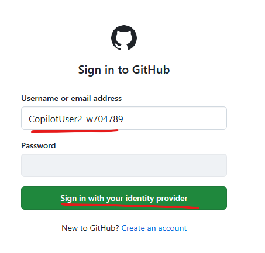
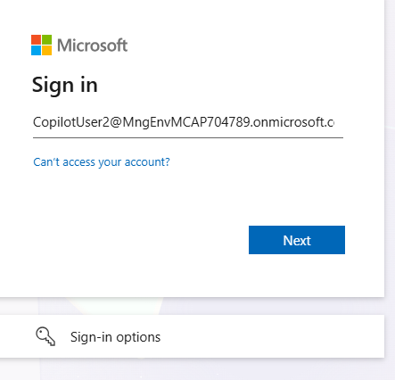
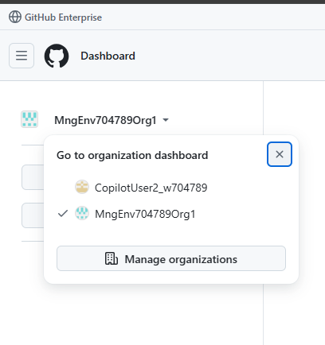
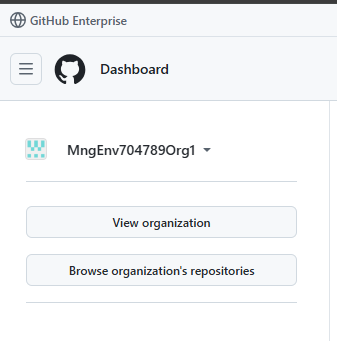
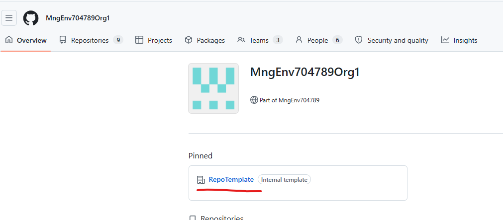
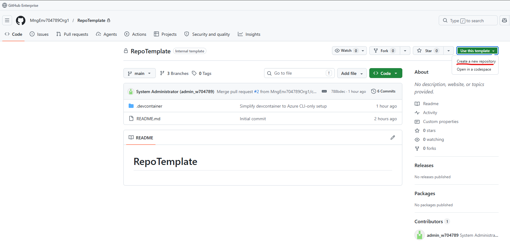
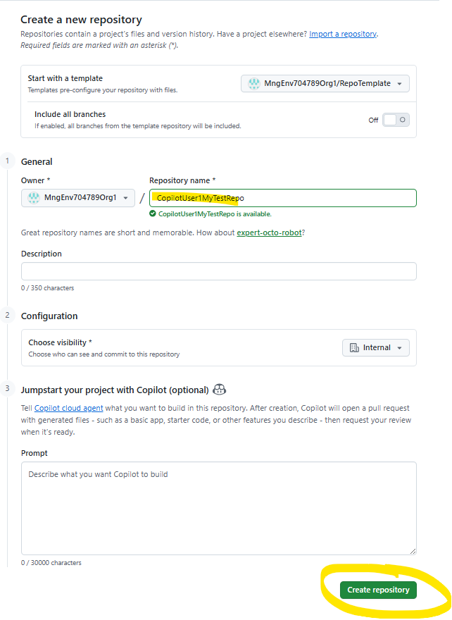
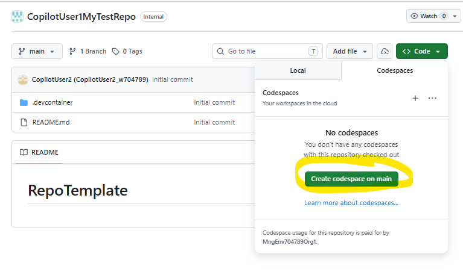
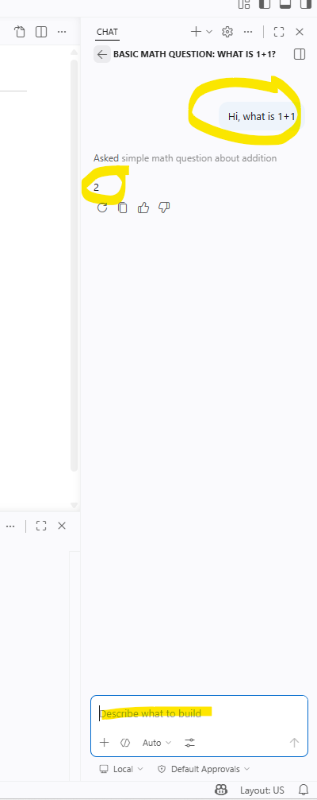

# Canberra Github Copilot hackathon

Welcome to the Github Copilot Hackathon. You will be given a piece of paper with a set of credentials. It will contain
- Email Address
- Temporary Access Password
- Github Alias

Using these credentials, you will be able to access what you need to complete the challenge using just your web browser.

## How to log in

Firstly, go to github.com and click on Sign In

## Type in your Github Alias

Type in your GitHub Alias and click on Sign in with your Identity Provider. You will then be routed to Entra ID

## Log in using your Email and Temporary Access Pass

## Go to MngEnv704789Org1 Org 

Click on View Organisation

## Go to the RepoTemplate

This is a template repo with all the files that you need

## Create your own repo based on this template

Enter a name (hint - as you'll be sharing this org with others, I would recommend you prefix your name to avoid confusion) and click Create Repository

## Open your repo in a Codespace

A Codespace is like a virtual environment that is reserved just for you to do your own development on. This codespace will have Copilot and Azure CLI already installed so you can get working straight away.

## Test Copilot works 

It might take a minute or two for the Codespace to spin up. Once it's up, let's give it a quick test to see if everything works.

Firstly, let's please ask Copilot a question

If this works, you are ready to begin the challenges!

